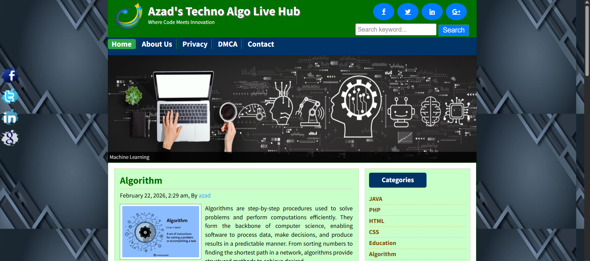
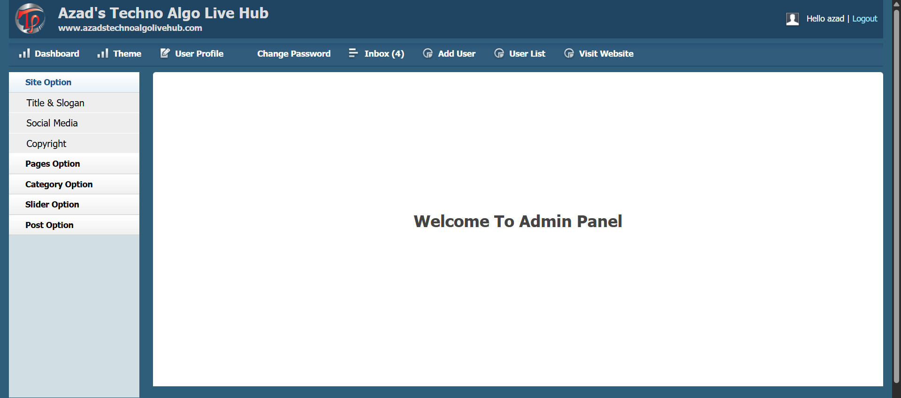

# 🌐 Azad's Techno Algo Live Hub

Azad's Techno Algo Live Hub is a dynamic live blog website developed using PHP Object-Oriented Programming (OOP).  
This platform focuses on Computer Science & Engineering (CSE) topics and serves as a complete technical blogging platform where users can explore blogs, tutorials, and articles across multiple tech domains.

---

## 🌟 Features

- Algo live homepages  
- Featured destinations slideshow  
- Search functionality  
- Responsive, user-friendly design  
- Contact Us page  
- Latest articles sidebar  
- Clean travel guide UI  

---

## 🗂️ Categories

Blog posts are organized under the following categories:  
- Java  
- PHP  
- HTML  
- CSS  
- Education  
- Algorithm  
- Programming Language  
- Machine Learning (ML)  
- Artificial Intelligence (AI)  
- Deep Learning (DL)  
- Research  
- Article  
- Competitive Programming (CP)  
- Internet of Things (IoT)  

---

## 🔐 Admin Panel

- Admin login system  
- Create, edit, and delete posts  
- Category management  
- Theme changer  
- User management  
- Password recovery via email  
- Send replies via user email  

---

## 🛠️ Technologies Used

- PHP (Object-Oriented Programming)  
- MySQL Database  
- HTML5  
- CSS3  
- JavaScript  
- Font Awesome  
- XAMPP (Local Development)  

---

## 🎯 Project Objective

This project demonstrates the practical application of PHP OOP principles in building a dynamic live blogging platform.  
It allows users to explore, read, and engage with technical blogs while giving admins full control over the website content and structure.

## Front-End

## Admin Panel

